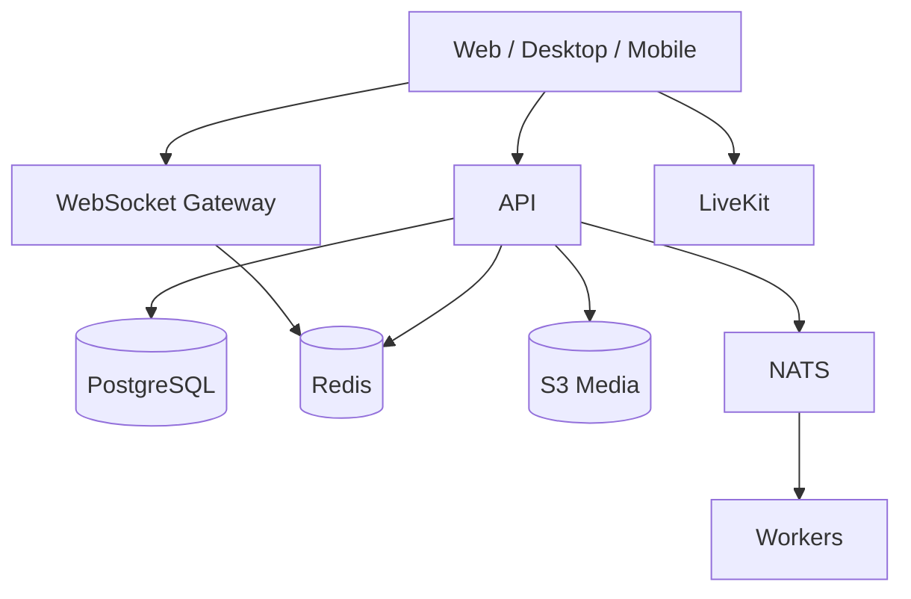

# Архитектура FlipZero

## Принципы

- Модульный монолит на старте с чёткими границами доменов.
- PostgreSQL является источником истины; Redis хранит presence, rate limits и короткоживущий кэш.
- Все клиентские изменения проходят через версионированный REST API.
- События реального времени доставляются отдельным WebSocket gateway.
- Медиа загружаются напрямую в S3-совместимое хранилище по подписанным URL.
- Голос и видео не реализуются собственным SFU: используется LiveKit.

## Домены

| Домен | Ответственность |
| --- | --- |
| Identity | Аккаунты, сессии, 2FA, passkeys |
| Spaces | Сообщества, участники, категории, приглашения |
| Permissions | Роли, права и channel overrides |
| Messaging | Сообщения, реакции, треды, вложения |
| Presence | Онлайн-статус и активность пользователей |
| Voice | Комнаты, LiveKit-токены, согласие на запись |
| Progression | XP, уровни, пути, достижения, лидерборды |
| Moderation | Жалобы, автомод, audit log, наказания |
| Notifications | Push, email и пользовательские настройки |

## Целевая инфраструктура

## API

- Базовый путь: `/api/v1`.
- Идентификаторы передаются строками, чтобы безопасно поддерживать Snowflake ID.
- Списки используют cursor pagination.
- Ошибки имеют стабильный `code`, понятный `message` и `requestId`.
- Идемпотентные мутации принимают заголовок `Idempotency-Key`.

## Безопасность

- Пароли хэшируются Argon2id.
- Сессии хранятся в защищённых HttpOnly cookies.
- Мутации защищены CSRF-проверкой и rate limiting.
- Права проверяются только на сервере; клиентская проверка отвечает лишь за отображение UI.
- Все действия модераторов записываются в неизменяемый audit log.
